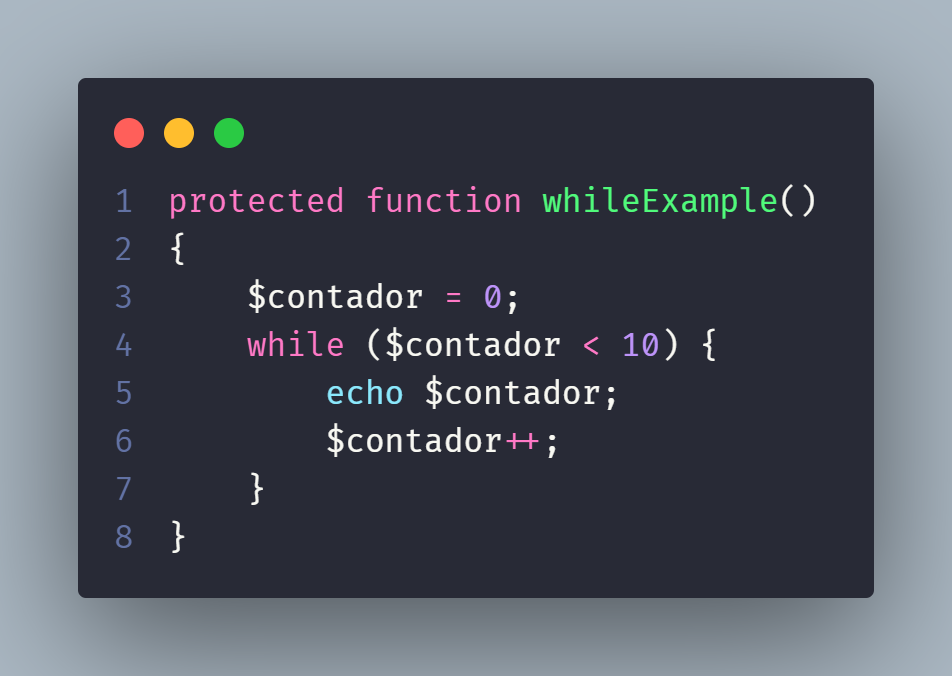
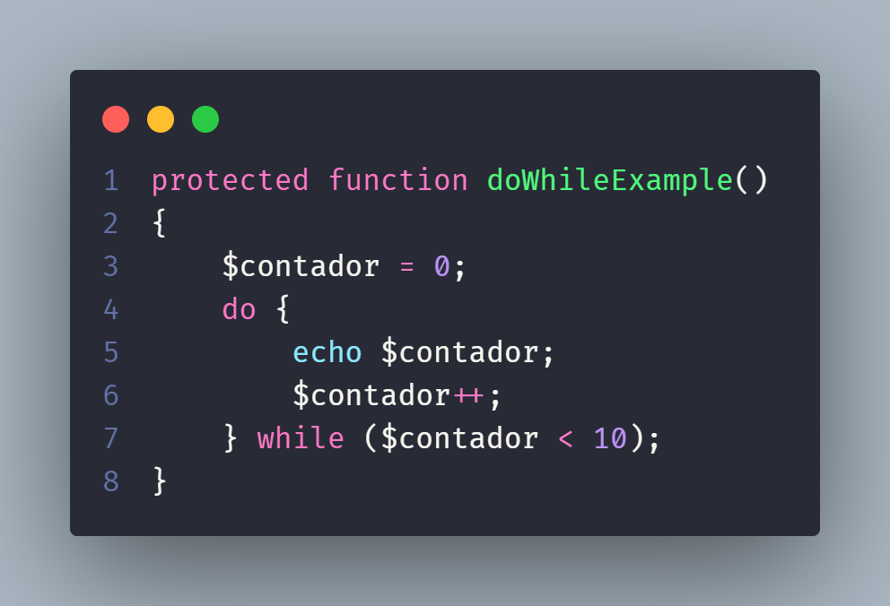
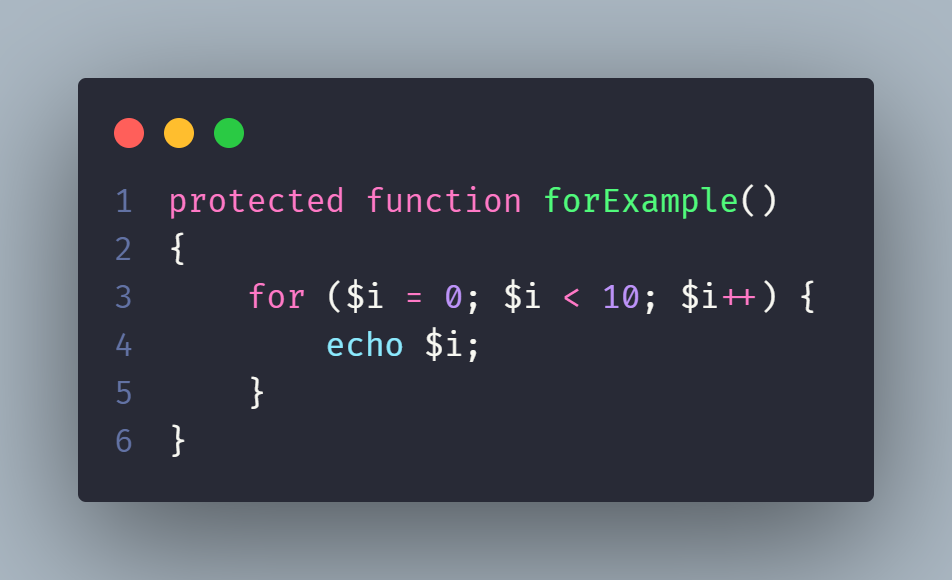
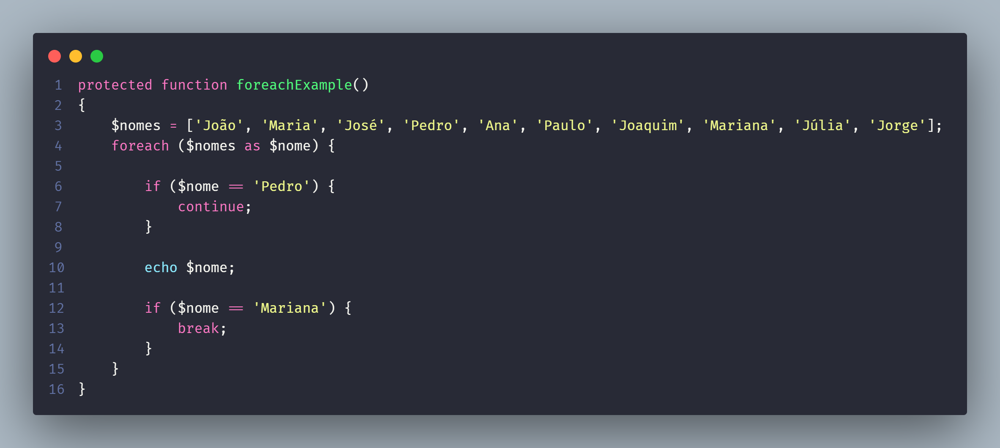
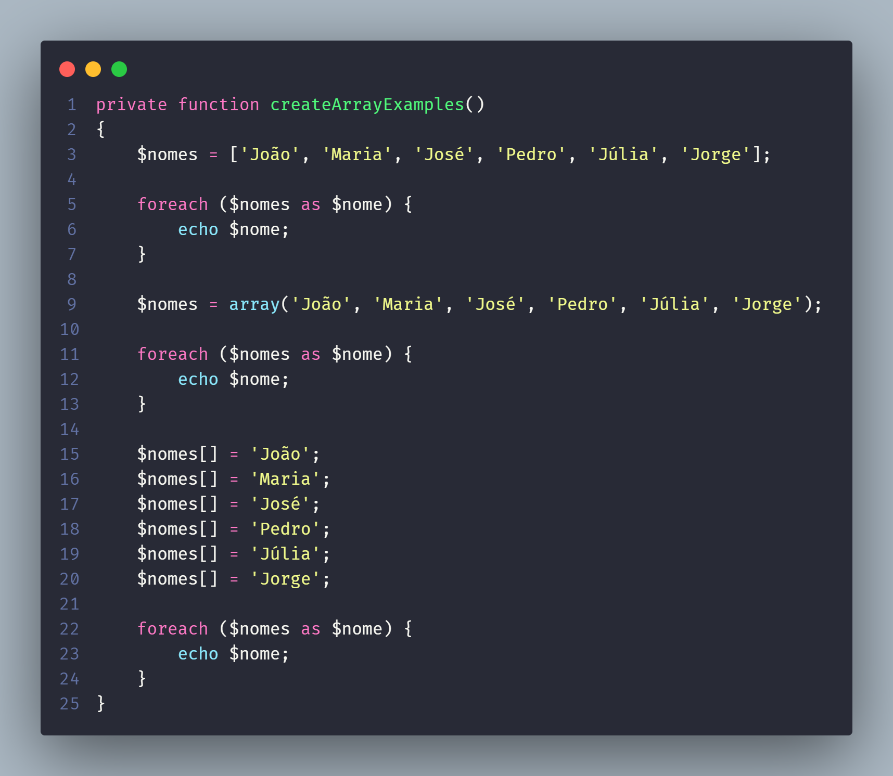
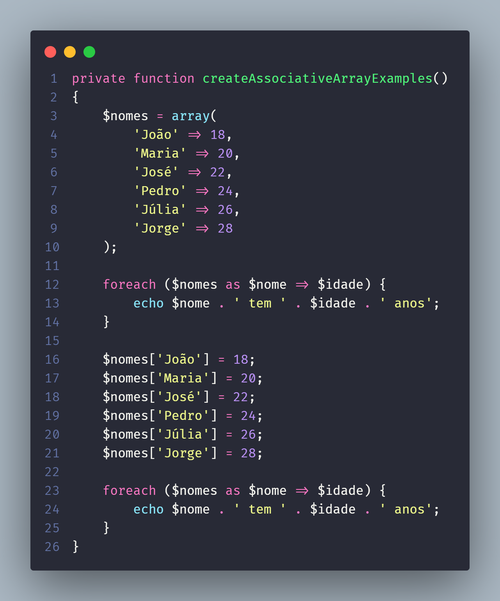
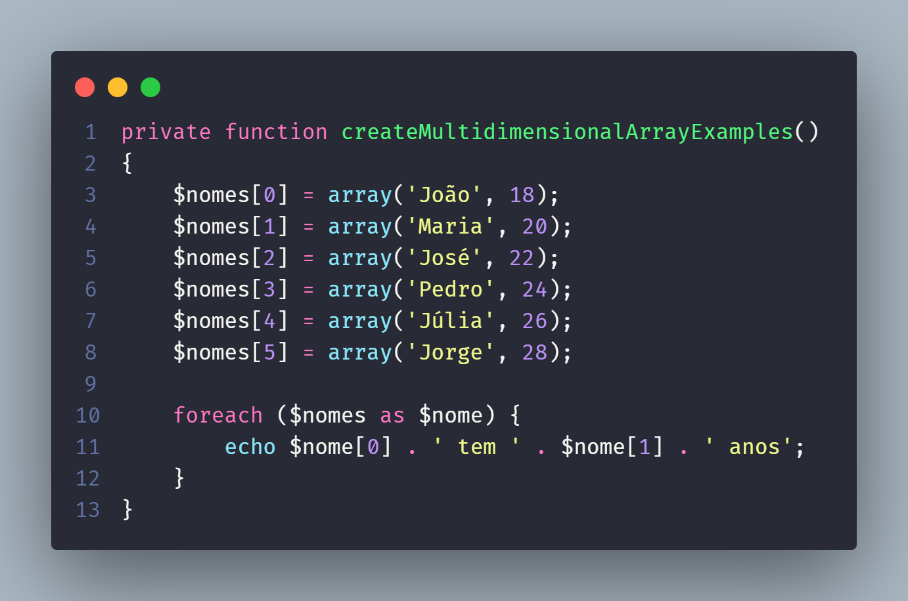
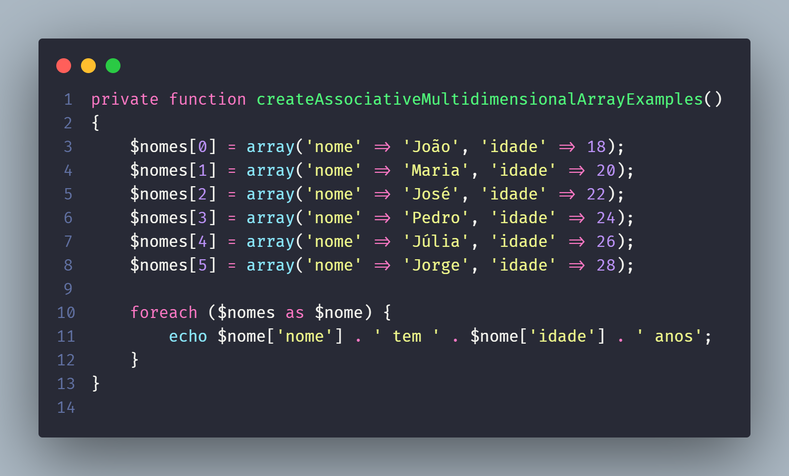

# PHP Laravel Example

Um pequeno projeto para exposição no seminário de de Linguagens de Programação.

## Uso/Exemplos

Uma breve explicação sobre PHP.

### Estruturas de decisão

Exemplos usando if, elseif e else:

Exemplo usando switch:

### Loops

Exemplos dos Loops presentes na linguagem.

Ex. while:

Ex. do while:

Ex. for:

Ex. foreach:

### Funções

Exemplo do corpo e estrutura de uma função:

* Access Modifier pode ser public, protected ou private

### Arrays

Formas de criar um array simples unidimensional:

Array Associativo (chave: valor):

Array Multidimensional:

Array Associativo e Multimensional:

## Funcionalidades

- Autenticação JWT
- Conexão com Banco de Dados (Sqlite3)
- Conceito de Migrations
- Login de usuário (com JWT)
- CRUD de Tarefas (TODO List)

## Autores

- [@LucasGitDev](https://www.github.com/LucasGitDev)

